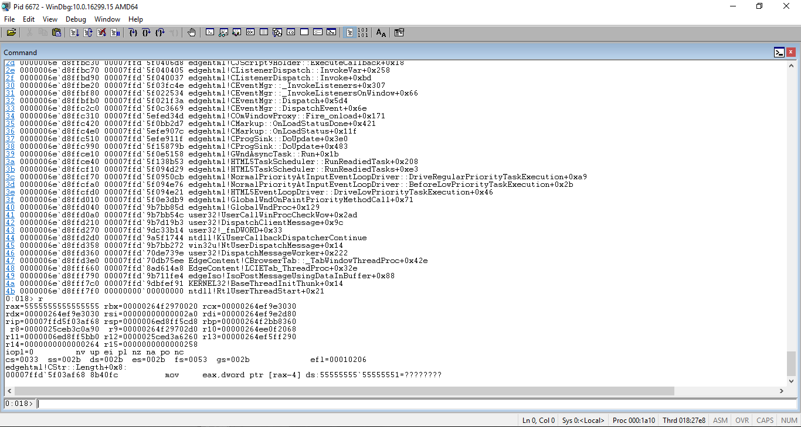
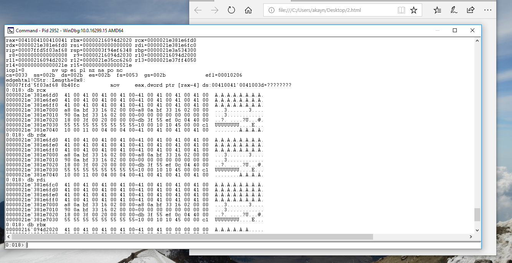
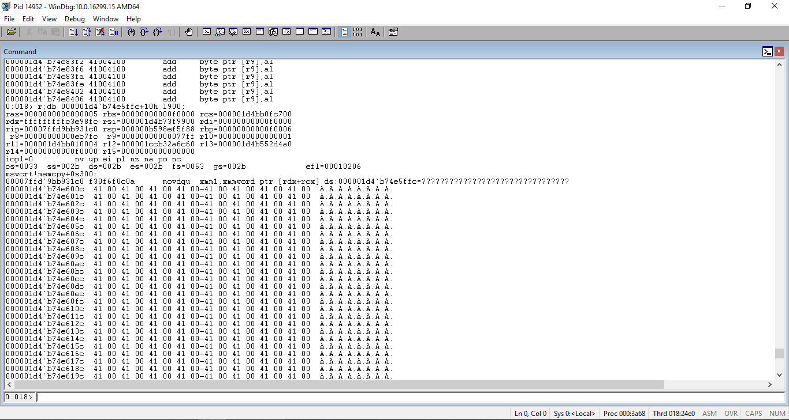

# Msrc Case: 41548 CRM:0001020892 Microsoft Edge multiple race conditions leading to rce.

So it all started with ivan fratric project zero <html><a href="https://googleprojectzero.blogspot.co.il/2017/09/the-great-dom-fuzz-off-of-2017.html">blog post and the new open source fuzzer-DOMATO.</a></html>. i have read the post and decided to try and experiment a little with fuzzing this browser.<br> it didnt take long for me to realize that menuel fuzzing will be too much of a pain and i began to write my own harness, in addition i made some changes and added extra api's to the fuzzer in order to get a little heads-up on the big amount of people who are currently running the fuzzer (i only had one machine).<br>
anyone who had ever fuzzed edge knows that there are a big amount of un-exploitable bugs in edge that can make the fuzzing work very difficult, one has to capture the debug output but to filter out those, it seems as if microsoft has no intention to fix any of those bugs. (a list will be given at the end of this article of about 500 dos conditions that go from division by zero to mem-gc protected uaf's).<br>
but, maybe to reader suprise, the difficult part was not coding the harness and overcoming the recent changes to edge ( Edge has become a full Universal Windows Platform (UWP) App. This means that the main Edge process no longer spawns any of the sandboxed child processes directly, but that all processes are spawned by the UWP framework.) that makes fuzzing this program to a somewhat challenging task, the most difficult part of this bug hunting quest was contacting msrc. i will try to add as little description as i possibly can to not sound like i got any opinion on the issue (although it will be a little difficult).

it was not long before i came across some intersting crash's, but none of them seemed to have any security context, and all this time i was thinking that maybe ivan released this too fast. another one of my thoughts was, maybe he simply gave up contacting msrc, seeing posts like this <html> <a href="https://bugs.chromium.org/p/project-zero/issues/detail?id=1237&can=1&q=&start=1000">one</a></html>.

well, i was about to give up, and have stoped my harness. this was the first day stable rs3 was out and i have upgraded my computer. it was also the time of this <html> <a href="https://twitter.com/dwizzzleMSFT/status/920637599449939968">public relations post</a></html> was out. and i decided to give one last longshot to the fuzzer. after running the automation during the night i have noticed one weird crash it looked as if edgehtml was trying to get a length of a url-string from a bogus address way too high to have any meaning. it didnt look exploitable at first but i thought i'd submit this anyway to msrc. like many of my previous submissions to that point i have received a ticket, but till' this day i didnt got any responce. i gave a closer look at the crash and began to see other forms of crash from this sample, some of them looked exploitable at first sight (crashing at memcpy read, or write VA). stupid as i was (the reader will understand later) i have quickly notified msrc about this and i was a little stressed out becouse jugding from my privies expiriance i had very little chance that someone will actually read my emails or take action upon this vulnerability, but on the other hand with a good harness anyone running this fuzzer will probably have better chance than me finding this vulnerability (i only had one machine). including bad people. as always i got a ticket. i continued to research this case and after reducing this test case i was left with this lines:

```javascript
var a1 = document.createElementNS("http://www.w3.org/2000/svg", "mpath");                   (1)                        
a1.style.setProperty("content", "var(--c)");                                                (2)                        
var a2 = a1.cloneNode();                                                                    (3)
```

1 -> has to be an mpath element any other will not crash the content provider.<br>
2 -> can be any variable, but if not set then the content provider will not crash.<br>
3 -> leads to use of uninitialized heap memory.<br><br>

the crash was as follows:<br><br>



<br><br>
where the address of rax was taken from rcx who was pointing to heap memory. i have noticed that this is indeed the microsoftedgecp heap memory becouse i could sometimes spot left-overs of the page that redirected to that page. seeking to find exploitability assessment, i tried to see if this data is controllable, after some hours of debugging the application i could controll the register value (by heap spray) who is later used to determine the length of a string to be allocated by the runtime. for whoever is looking to see how one can exploit that oob r/w for rce you can look at this great <html><a href="https://googleprojectzero.blogspot.co.il/2014/07/pwn4fun-spring-2014-safari-part-i_24.html">blogpost</a></html> from Ian beer.<br><br>

here are some graphics for the reader:<br><br>

<br><br>





